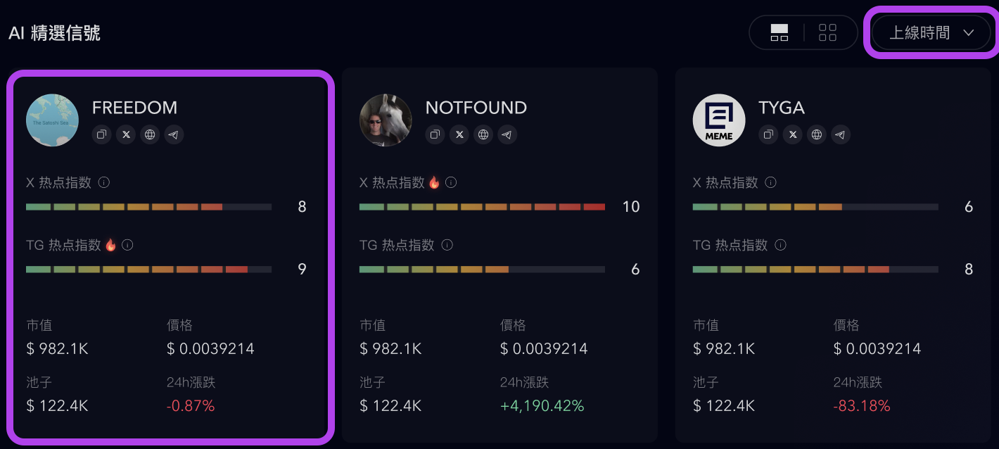
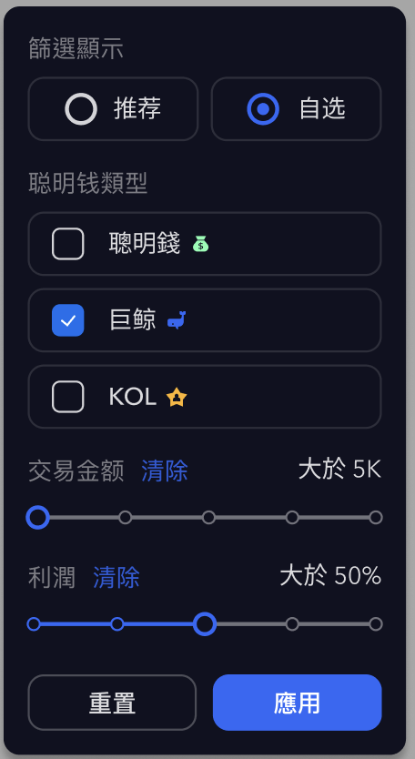
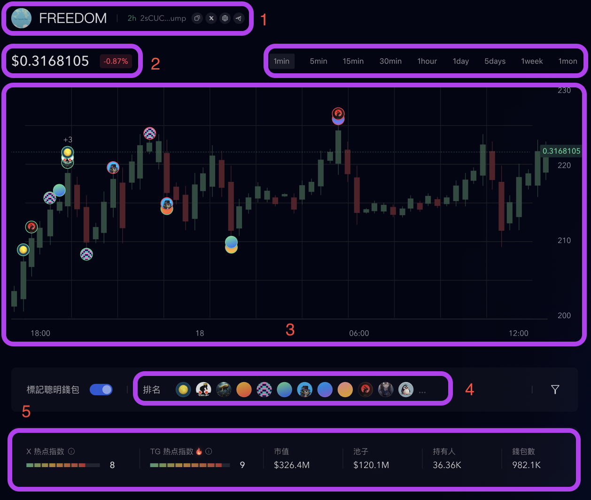

# API Spec

## AI 精選信號



這邊需要提供時間排序的功能，及提供各個幣種的交易跟熱度資訊，並提供分頁資訊。

`/api/v1/<AI 精選信號>/[chain]?sort=up_time`

### path params

- `chain` - `eth`, `sol`

### query params

- `sort` - 排序方式，預設為上線時間，可選 `up_time` (待確認選項)

### body

- `logo` - 幣種圖片 (string)
- `symbol` - 幣種名稱 (string)
- `address` - 幣種地址 (string)
- `link` - 幣種連結 (string)

```json
{
    link: {
        website: string | null;
        x: string | null;
        telegram: string | null;
    }
}
```

- `heat` - 熱點指數

```json
{
    heat: {
        x: number;
        telegram: number;
    }
}
```

- `market-capitalization` - 市值 (number)
- `price` - 價格 (number)
- `pool` - 池子 (number)
- `up-down` - 漲跌 (number)

## 幣詳情

`/api/v1/[chain]/[token]?interval=&filter=&smart-money=&transaction=&profit=`

### path params

- `chain` - `eth`, `sol`
- `token` - 幣種地址

### query params



- `interval` - 時間區間，預設為 `1min`，可選 `1min`, `5min`, `15min`, `30min`, `1h`, `1d`, `5d`, `1w`, `1mon`
- `filter` - 預設為 `recommend`，可選 `recommend`, `manual`
- `smart-money` - 可選 `smart-money`, `whale`, `kol`
- `transaction` - (待確認區間)
- `profit` - (待確認區間)

### body



1. info

- `symbol` - 幣種名稱 (string)
- `address` - 幣種地址 (string)
- `link` - 幣種連結 (string)

```json
{
    link: {
        website: string | null;
        x: string | null;
        telegram: string | null;
    }
}
```

2. price

- `price` - 價格 (number)
- `up-down` - 漲跌 (number)

3. k 線圖

```json
[
 { open: 10, high: 10.63, low: 9.49, close: 9.55, time: '2025-03-04' },
]
```

4. 聰明錢包標記

```json
[
 {
    time: '2025-03-04',
    position: 'below',
    src: 'https://avatars.githubusercontent.com/u/38397958?v=4',
  },
  {
    time: '2025-03-05',
    position: 'up',
    src: 'https://avatars.githubusercontent.com/u/38397958?v=4',
  },
]
```

5. 熱度資訊

- `heat` - 熱點指數

```json
{
    heat: {
        x: number;
        telegram: number;
    }
}
```

- `market-capitalization` - 市值 (number)
- `pool` - 池子 (number)
- `holder` - 持有人 (number)
- `wallet` - 錢包數 (number)
