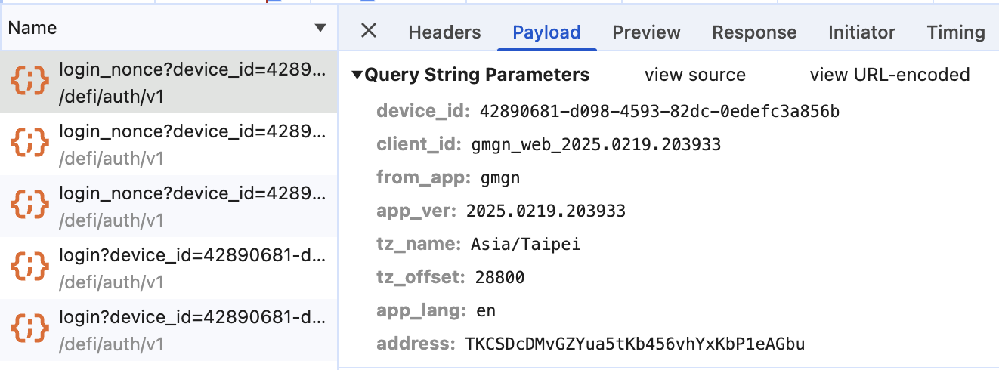
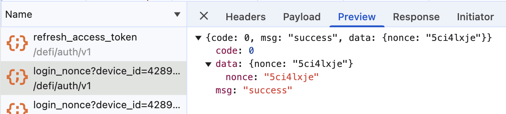
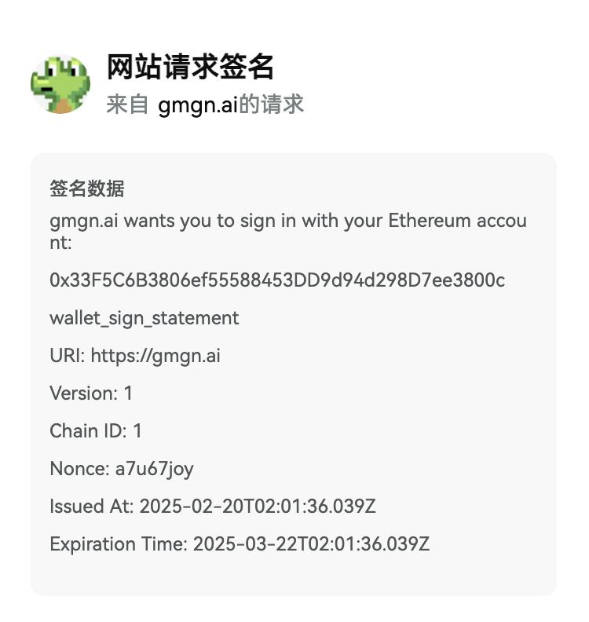

# 錢包登入

這裡需要區分網路，針對不同的 VM 我們的 sign message 會有不同的格式。

## EVM (ETH, BSC)

前後端可以透過 SIWE 的套件來生成 sign message 跟解析。

- [Node, client](https://github.com/spruceid/siwe)
- [GO](https://github.com/spruceid/siwe-go)

### 生成 nonce（亂數）

一開始後端需要先生成一個 nonce，這個 nonce 會在登入時被簽名，為一個隨機亂數即可，但需要在後續做比對，所以前端在取得 nonce 時需要帶入 account address 或其他資訊，以確保 nonce 是對應的。





### 前端生成 sign message

前端拿到 nonce 後，可以透過 SIWE 來生成 sign message，這個 sign message 會在登入時被後端驗證。(message 結構式如下)



```tsx
import * as React from 'react'
import { useAccount, useNetwork, useSignMessage } from 'wagmi'
import { SiweMessage } from 'siwe'
 
function SignInButton({
  onSuccess,
  onError,
}: {
  onSuccess: (args: { address: string }) => void
  onError: (args: { error: Error }) => void
}) {
  const [state, setState] = React.useState<{
    loading?: boolean
    nonce?: string
  }>({})

  const { address } = useAccount()
  const { chain } = useNetwork()
  const { signMessageAsync } = useSignMessage()
 
  // Pre-fetch random nonce when button is rendered
  // to ensure deep linking works for WalletConnect
  // users on iOS when signing the SIWE message
  React.useEffect(() => {
    const fetchNonce = async () => {
    try {
      const nonceRes = await fetch(`/api/nonce?address=${address}`)
      const nonce = await nonceRes.text()
      setState((x) => ({ ...x, nonce }))
    } catch (error) {
      setState((x) => ({ ...x, error: error as Error }))
    }
  }
    
    fetchNonce()
  }, [])
 
  const signIn = async () => {
    try {
      const chainId = chain?.id
      if (!address || !chainId) return
 
      setState((x) => ({ ...x, loading: true }))
      // Create SIWE message with pre-fetched nonce and sign with wallet
      const message = new SiweMessage({
        domain: window.location.host,
        address,
        statement: 'Sign in with Ethereum to the app.',
        uri: window.location.origin,
        version: '1',
        chainId,
        nonce: state.nonce,
      })
      const signature = await signMessageAsync({
        message: message.prepareMessage(),
      })
 
      // Verify signature
      const verifyRes = await fetch('/api/verify', {
        method: 'POST',
        headers: {
          'Content-Type': 'application/json',
        },
        body: JSON.stringify({ message, signature }),
      })
      if (!verifyRes.ok) throw new Error('Error verifying message')
 
      setState((x) => ({ ...x, loading: false }))
      onSuccess({ address })
    } catch (error) {
      setState((x) => ({ ...x, loading: false, nonce: undefined }))
      onError({ error: error as Error })
      fetchNonce()
    }
  }
 
  return (
    <button disabled={!state.nonce || state.loading} onClick={signIn}>
      Sign-In with Ethereum
    </button>
  )
}
```

### 後端驗證 sign message

後端也可以透過 siwe-go 來驗證 sign message，驗證完的 message 會有一個公鑰，可以用這個公要來生一組 token。

- 這邊可以用 session cookie 的方式來對前端 set cookie，前端也可以透過 GET (/session) 來取的跟刷新 token。
- 或是透過 JWT ，後端回傳 access token 跟 refresh token，前端可以透過 refresh token 來取得新的 access token。

```go
// This is a simple example of how to implement a web3 login endpoint using the siwe-go library.
package main
 
import (
 "errors"
 "fmt"
 "net/http"
 "os"
 "time"
 
 "github.com/ethereum/go-ethereum/common/hexutil"
 "github.com/ethereum/go-ethereum/crypto"
 "github.com/golang-jwt/jwt/v5"
 "github.com/spruceid/siwe-go"
)
 
const port = ":8080"
 
func main() {
 http.HandleFunc("/api/v1/auth/web3:login", func(w http.ResponseWriter, r *http.Request) {
  if r.Method != http.MethodPost {
   http.Error(w, "Method not allowed", http.StatusMethodNotAllowed)
   return
  }
  err := Web3Login(w, r)
  if err != nil {
   http.Error(w, err.Error(), http.StatusInternalServerError)
  }
 })
 
 err := http.ListenAndServe(port, nil)
 if err != nil {
  fmt.Println("Error starting server:", err)
 }
}
 
// verifyWalletSignature verifies the signature of a wallet address
func verifyWalletSignature(messageStr string, sig string) (jwt.MapClaims, error) {
 
 message, err := siwe.ParseMessage(messageStr)
 if err != nil {
  err = fmt.Errorf("parse message err: %v", err)
  return nil, err
 }
 
 verify, err := message.ValidNow()
 if err != nil {
  err = fmt.Errorf("verify message err: %v", err)
  return nil, err
 }
 
 if !verify {
  err = fmt.Errorf("verify message fail: %v", err)
  return nil, err
 }
 
 publicKey, err := message.VerifyEIP191(sig)
 
 if err != nil {
  err = fmt.Errorf("verifyEIP191 err: %v", err)
  return nil, err
 }
 
 pubBytes := crypto.FromECDSAPub(publicKey)
 publicKeyString := hexutil.Encode(pubBytes)
 
 // Return the verified claims
 claims := jwt.MapClaims{
  "web3_pub_key": publicKeyString,
 }
 return claims, nil
}
 
// LoginRequest represents the login request body
type LoginRequest struct {
 Message   string `json:"message"`
 Signature string `json:"signature"`
}
 
func Web3Login(w http.ResponseWriter, r *http.Request) error {
 // Parse the login request body
 req := new(LoginRequest)
 
 // Verify the signature
 claims, err := verifyWalletSignature(req.Message, req.Signature)
 if err != nil {
  return errors.New(err.Error())
 }
 
 // Generate a JWT token
 token := jwt.NewWithClaims(jwt.SigningMethodHS256, claims)
 tokenString, err := token.SignedString([]byte(os.Getenv("JWT_SECRET")))
 if err != nil {
  return errors.New("error creating JWT token")
 }
 
 // Set the JWT token in the response header
 http.SetCookie(w, &http.Cookie{
  Name:    "jwt_token",
  Value:   tokenString,
  Expires: time.Now().Add(time.Hour * 24),
 })
 
 // Return a success response
 w.WriteHeader(http.StatusOK)
 return nil
}
```

## SVM (Solana)

```ts
import { SolanaSignInInput } from "@solana/wallet-standard-features";
import { useWallet } from '@solana/wallet-adapter-react';

export const createSignInData = async (): Promise<SolanaSignInInput> => {
  const now: Date = new Date();
  const uri = window.location.href
  const currentUrl = new URL(uri);
  const domain = currentUrl.host;

  // Convert the Date object to a string
  const currentDateTime = now.toISOString();
  const signInData: SolanaSignInInput = {
    domain,
    statement: "Sign in with Solana to the app.",
    version: "1",
    nonce: "", // get from api
    chainId: "mainnet",
    issuedAt: currentDateTime,
    resources: ["https://donkin.ai"],
  };

  return signInData;
};

const SignButton = () => {
  const { wallet, publicKey, connect, disconnect, signMessage, signIn } = useWallet();

  const handleSignIn = useCallback(async () => {
    if (!publicKey || !wallet) return;
    const signInData = await createSignInData();

    try {
      const {account, signedMessage, signature} = await signIn(signInData);
      createLog({
        status: 'success',
        method: 'signIn',
        message: `Message signed: ${JSON.stringify(signedMessage)} by ${account.address} with signature ${JSON.stringify(signature)}`,
      });
    } catch (error) {
      createLog({
        status: 'error',
        method: 'signIn',
        message: error.message,
      });
    }
  }, [createLog, publicKey, signIn, wallet]);

  /** Connect */
  const handleConnect = useCallback(async () => {
    if (!publicKey || !wallet) return;

    try {
      await connect();
    } catch (error) {
      createLog({
        status: 'error',
        method: 'connect',
        message: error.message,
      });
    }
  }, [connect, createLog, publicKey, wallet]);

  return ...
}
```
